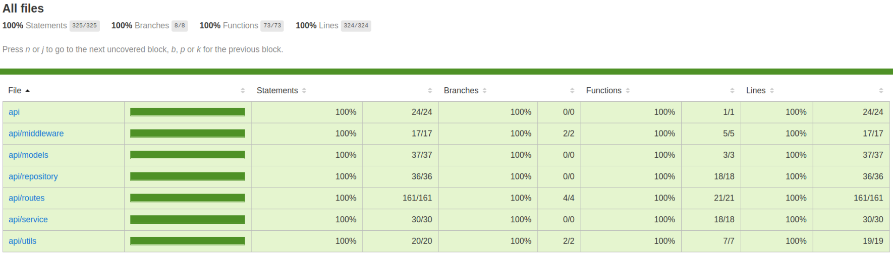

# Facebook API

웹 사이트 URL : http://woomin-facebook.s3-website.ap-northeast-2.amazonaws.com  
테스트 유저 ⇒ 아이디: test / 비밀번호: test

<br />

## 프로젝트 소개

2020.02.02 ~ 2020.04.21  
Facebook을 클론 코딩한 프로젝트입니다.

<br />

## 실행방법

FrontEnd ([README Here](https://github.com/Woomin-Jeon/SNS-project-Frontend/blob/master/README.md))

```javascript
$ git clone git@github.com:Woomin-Jeon/SNS-project-Frontend.git
$ npm install
$ npm start
```

Api

```javascript
$ git clone git@github.com:Woomin-Jeon/SNS-project-API.git
$ npm install
$ npm start
```

<br />

## 테스트

```javascript
$ npm run unit : Unit Test
$ npm run integration : Integration Test
```



<br />
<br />

## 구현 API

| **About User** |                   |
| -------------- | ----------------- |
| GET /session   | 세션 확인         |
| POST /session  | 로그인            |
| PATCH /session | 로그아웃          |
| GET /socket    | 소켓ID 불러오기   |
| GET /login     | 유저정보 불러오기 |
| POST /login    | 회원가입          |
| PATCH /profile | 프로필 사진 추가  |
| POST /friends  | 친구 추가 하기    |
| PATCH /friends | 친구 제거 하기    |

<br />

| **About Post** |                   |
| -------------- | ----------------- |
| GET /posts     | 게시글 불러오기   |
| PATCH /posts   | 게시글 수정       |
| POST /posts    | 게시글 추가       |
| DELETE /posts  | 게시글 삭제       |
| PATCH /like    | 게시글에 좋아요   |
| POST /upload   | 사진 업로드       |

<br />

| **About Comment**  |                |
| ------------------ | -------------- |
| GET /comments      | 댓글 불러오기  |
| POST /comments     | 댓글 달기      |
| PATCH /comments    | 댓글 개수 +1   |
| POST /childcomment | 대댓글 달기    |
| PATCH /commentlike | 댓글에 좋아요  |
